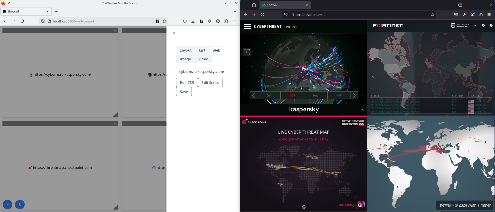

# TheWall



TheWall is a web application for managing a wall of screens.
It can show multiple web pages, images, and videos on a large or wall of screens.
Layouts can be created and changed on the fly using a drag-and-drop web interface.

The output is displayed by Firefox running in fullscreen mode.
To use a grid of screens, NVidia Mosaic or AMD Eyefinity is advised to be used to create a single large display.

## Usage

TheWall is a web application built with Nuxt.
To run the application, you need to have Node.js and NPM installed.

To run the application for development, follow these steps:
```
npm install
npm run dev
```

Due to CSP and Frame-Options headers, by default, you can't embed all external websites.
To circumvent this, you need to install the browser extension, provided in the `extension` folder.
This extension will remove the headers from the response, allowing you to embed any website.

When you host the server not on 'localhost', Firefox may block cookies of shown websites due to Enhanced Tracking Protection.
To prevent this, you need to disable Enhanced Tracking Protection for the TheWall server's domain.

You can download and install a signed version of the extension from the [Mozilla Add-ons website](https://addons.mozilla.org/en-US/firefox/addon/thewall/).

The wall computer can access the rendered wall by visiting `http://SERVER_IP:3000/WALL_ID`.
You can make TheWall fullscreen by pressing `F11`.
To allow TheWall to run fullscreen by default, you can set the `full-screen-api.allow-trusted-requests-only` preference to `false` in `about:config`.
This will allow TheWall (and any other website) to request fullscreen mode without user interaction.

If you installed the extension, you will be redirected to the extension options page if TheWall is running on a different origin than http://localhost:3000.
As a security measure, you need to set the origin of the server on the options page.
If you want to allow injecting custom JavaScript, you need to enable the `Allow JavaScript injects` option.

The control computer can access the control panel by visiting `http://SERVER_IP:3000/WALL_ID/control`.

Where `SERVER_IP` is the IP address of the server running the application, and `WALL_ID` is the ID of the wall you want to access.

## Limitations

Due to security restrictions, websites can't be totally fooled into thinking they are running in as a top-level document.
This means that some websites may not work correctly when shown on the wall.
For example, websites that use the `window.top` object to check if they are running in an iframe will not work correctly.
To circumvent this, you can inject custom JavaScript to change the behavior of the website.

## WebRTC

TheWall supports WebRTC for sharing your screen with the wall.
This feature should work out of the box, as long as the wall computer and the control computer can directly communicate with each other.
If the wall computer or the control computer is behind a NAT, you need to configure a STUN and/or TURN server.
The STUN and TURN server can be configured in the `config.json` file.

```json
{
  "public": {
    "iceServers": [
      {
        "urls": "stun:stun.l.google.com:19302"
      },
      {
        "urls": "turn:yourturnserver.com:3478",
        "username": "USERNAME",
        "credential": "PASSWORD"
      }
    ]
  }
}
```

## Security Considerations

Ensure that the server running TheWall is thrusted and not accessible by unauthorized users.
TheWall does support basic authentication by creating a `users.json` file in the root of the project.
The file should contain a array of objects with the following structure:
```json
[
  {
    "username": "admin",
    "password": "password"
  }
]
```

It is advised to run the application behind a reverse proxy with HTTPS enabled if you want to access the application over a network.

Everyone with access to the server can change the websites displayed on the wall and inject custom CSS and if enabled also inject custom JavaScript.
The extension will also reduce the security of the displayed websites by changing security related headers.

## Copyright and License
Copyright 2024 Iwan Timmer.
Distributed under the GNU AGPL v3.
For full terms see the [COPYING](COPYING) file

Available under alternative licensing terms upon request.
